# 🏗️ DefenseRAG v2.1.0 Architecture

**System Version:** 2.1.0 (Certified)
**Date:** 27/01/2026

## 🧩 High-Level "Divide & Conquer" Flow

This diagram illustrates how the system handles complex aggregation queries (e.g., *"Sum the guarantees of Contract A and Contract B"*) versus simple queries.

```mermaid
graph TD
    User([👤 User Query]) --> Planner[🧠 Planner Agent]
    
    Planner -->|Classes Query| Decision{Complexity?}
    
    %% Simple Path
    Decision -->|Simple| SingleQuery[⚡ Single Search]
    SingleQuery --> SmartRetrieval_S[🔍 Hybrid Retrieval]
    
    %% Complex Path
    Decision -->|Aggregation/Multi-hop| Decomposer[🔨 Decomposer]
    Decomposer -->|Split| SubQ1[📝 Sub-Query 1]
    Decomposer -->|Split| SubQ2[📝 Sub-Query 2]
    Decomposer -->|Split| SubQ3[📝 Sub-Query N]
    
    subgraph Parallel Retrieval Loop
        SubQ1 --> SmartRetrieval_1[🔍 Hybrid Retrieval]
        SubQ2 --> SmartRetrieval_2[🔍 Hybrid Retrieval]
        SubQ3 --> SmartRetrieval_3[🔍 Hybrid Retrieval]
        
        SmartRetrieval_1 --> Rerank_1[🎯 Re-Ranker]
        SmartRetrieval_2 --> Rerank_2[🎯 Re-Ranker]
        SmartRetrieval_3 --> Rerank_3[🎯 Re-Ranker]
    end
    
    Rerank_1 --> ContextPool[📚 Context Pool]
    Rerank_2 --> ContextPool
    Rerank_3 --> ContextPool
    SmartRetrieval_S --> ContextPool
    
    ContextPool --> Deduplication[🧹 Deduplication]
    Deduplication --> Synthesis[🤖 Synthesis Agent 'GPT-4o']
    Synthesis --> FinalResponse([📄 Certifiable Answer])

    style Planner fill:#f9f,stroke:#333,stroke-width:2px
    style Synthesis fill:#bbf,stroke:#333,stroke-width:2px
    style ContextPool fill:#bfb,stroke:#333,stroke-width:2px
```

---

## 🔍 Hybrid Retrieval Engine (Smart Retrieval)

Detail of the internal retrieval logic used for *every* sub-query.

```mermaid
flowchart LR
    Input[Query] --> Parallel{Parallel Search}
    
    %% Vector Search
    Parallel -->|Semantic| VectorDB[(ChromaDB)]
    VectorDB -->|Cosine Sim| ResultsVec[Vector Candidates]
    
    %% Keyword Search
    Parallel -->|Exact Match| BM25[BM25 Index]
    BM25 -->|Keywords| ResultsBM25[Keyword Candidates]
    
    %% Fusion
    ResultsVec --> RRF[🔄 Reciprocal Rank Fusion]
    ResultsBM25 --> RRF
    
    RRF --> Top30[Top 30 Candidates]
    Top30 --> Reranker[🧠 BGE-M3 Reranker]
    Reranker --> Top10[⭐ Top 10 Context Chunks]
```

## 🛡️ Critical Components

### 1. Planner Agent (`src/agents/planner.py`)
*   **Role**: The brain of the operation.
*   **Logic**: Uses Few-Shot Prompting to detect if a query needs to be split.
*   **Safety**: If decomposition fails, falls back to a robust single-query search.

### 2. Context Awareness
*   **Metadata Filtering**: Automatically extracts filters like `num_contrato` or `nsn_code` to narrow down search scope before hitting the VectorDB.
*   **Deduplication**: Ensures that if multiple sub-queries return the same chunk, it's only fed to the LLM once.

### 3. Synthesis Agent (`src/agents/synthesis.py`)
*   **Citation Engine**: Enforces that every claim is backed by a `[Doc: X]` reference.
*   **Hallucination Check**: If context is missing, explicitly states "Information not found" (Score 1) rather than inventing data.
